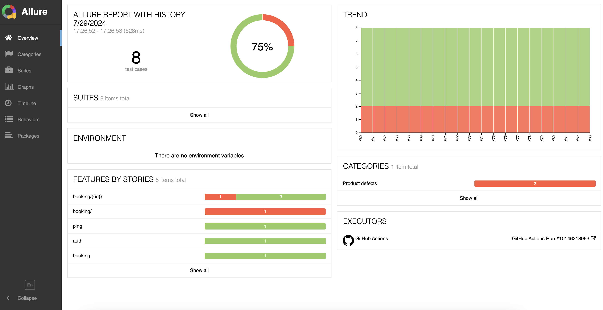
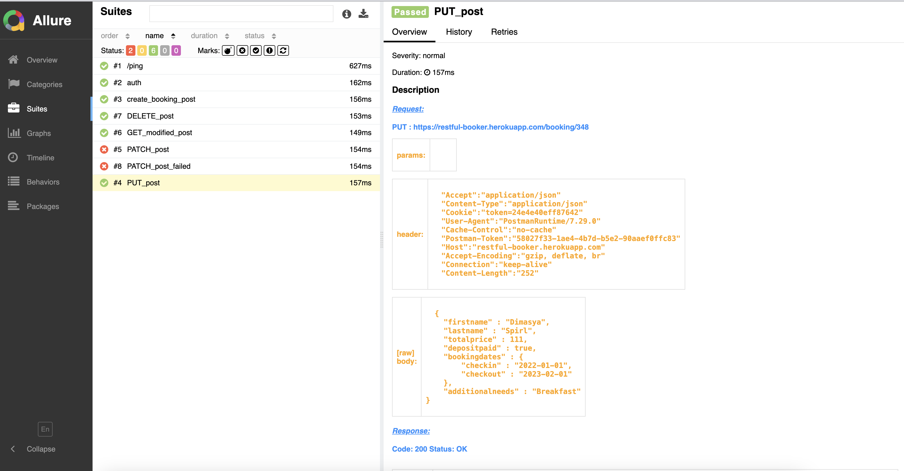
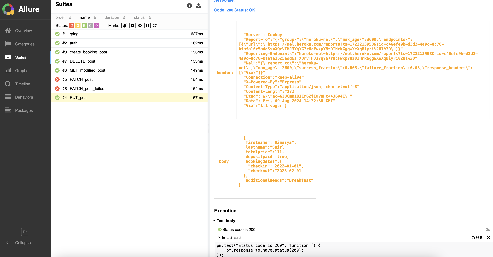
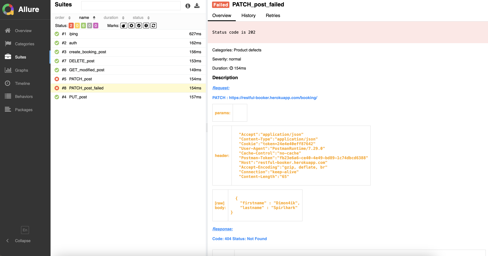
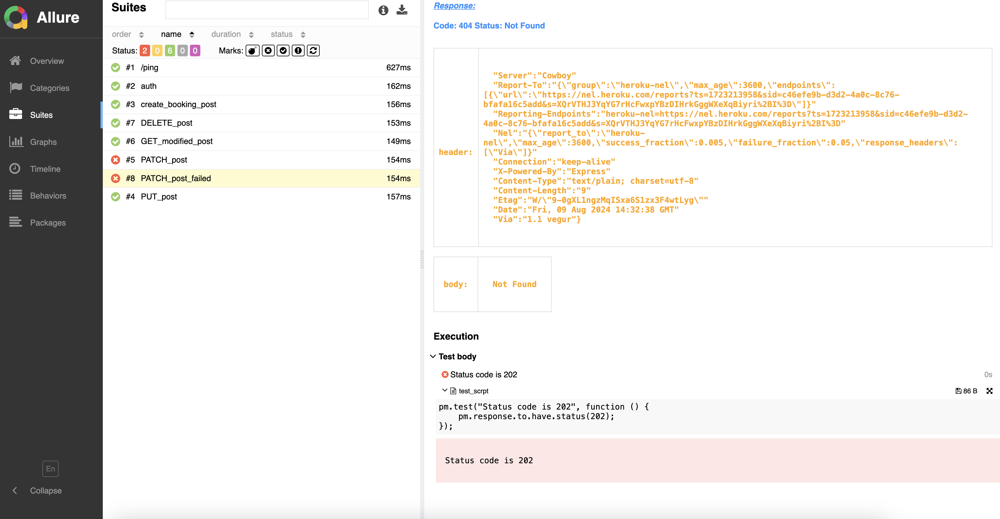

# Postman Collection Run

This project provides the ability to integrate Postman collections into the Continuous Integration (CI) process, allowing API tests to be run automatically. The results of running collections are processed and presented as a detailed Allure report that contains complete information about each request, including its parameters, responses and possible errors. This provides visibility and convenience when analyzing test results, allowing you to quickly identify and fix problems in the API.

## Сontent
- [Technology](#Technology)
- [Requirements](#Requirements)
- [Installation](#Installation)
- [Execution](#Execution)
- [Report](#Report)
- [License](#License)

## Technology
- [Postman](https://www.postman.com/)
- [Newman](https://www.npmjs.com/package/newman/)
- [Allure](https://allurereport.org/)

## Requirements
To install and run the project, you need [NodeJS](https://nodejs.org/), [Java](https://www.java.com/) version 8 or above.

## Installation

1. Install Allure-Report

2. Install the npm package using the command:
```sh
npm install -g newman
npm install -g newman-reporter-my_allure.tgz
```

## Execution

1. Export your Postman Collection and Environment (if used) to the `pm` project folder.

2. Execute the command to run your collection by specifying:
```sh
newman run pm/restful-booker.postman_collection.json -e pm/booking_env.postman_environment.json -r my_allure
```
- `pm/restful-booker.postman_collection.json` => collection file in the `pm` folder
- `pm/booking_env.postman_environment.json` =>  environment file in `pm` folder
- `my_allure` => Reporter Name 
- The files for the report will be generated, based on the results of the collection in the `allure-results` folder.

3. Execute the command to generate a report to the `allure-report` folder:
```sh
allure generate
```
4. Execute the command to open the report in a browser:
```sh
allure serve
```

## Report







## Why was this project developed?
Postman is a convenient and intuitive tool that has become an integral part of the daily work of many developers and testers. Thanks to its simplicity and flexibility, Postman has become an indispensable tool for testing and automating APIs, allowing you to add different types of checks for running requests. With the help of this project, you can easily run ready-made Postman collections and get detailed reports that will help you gain a deeper understanding of test results and find and fix possible problems faster. This makes the testing process not only efficient, but also as convenient as possible.


## License
This project is licensed under the MIT License - see the [LICENSE](LICENSE) file for details
